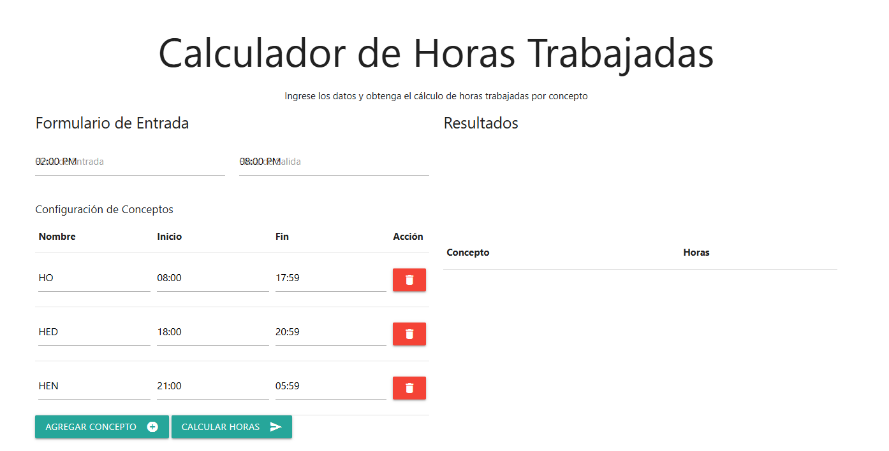
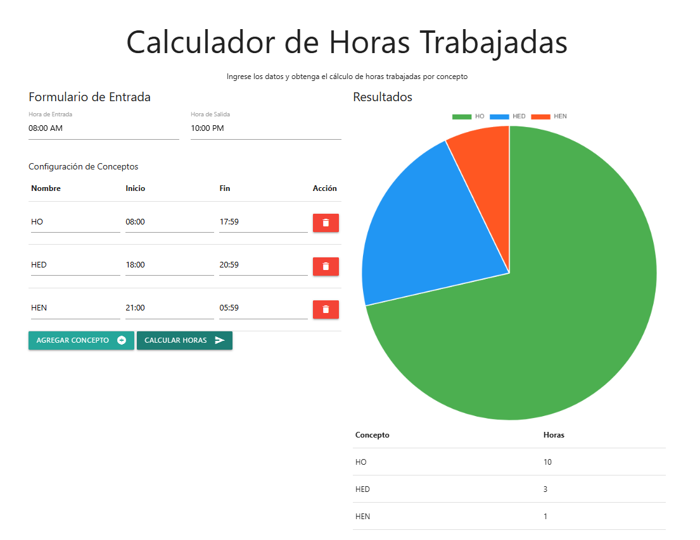

# Calculador de Horas Trabajadas por Concepto

Este proyecto es una aplicación web para calcular las horas trabajadas por concepto basándose en un horario de entrada y salida. La aplicación utiliza un servicio REST para realizar los cálculos, y los resultados se visualizan de manera gráfica y tabular. Durante el desarrollo y pruebas locales, se identificó y manejó el problema de **CORS**.

## url disponible : 
```bash
   https://jorgem-05.github.io/Test-Cari-A-Jorge-Munoz
```

## Problema de CORS

El servicio REST utilizado en este proyecto está sujeto a restricciones de **CORS (Cross-Origin Resource Sharing)**, lo que impide realizar solicitudes directas desde el navegador en ciertas condiciones.
Para superar este problema, se recomienda:

 **Configuración del servidor **:
   La solución definitiva sería ajustar las configuraciones del servidor REST para incluir el encabezado:
   ```http
   Access-Control-Allow-Origin: *
   ```
## solucion temporal CORS

1. La solucion temporal radica en crear un proxi para lograr pasarar las restricciones de servidor
2. he configurado un proxi para enrutar las peticiones que realiza frontEnd lo cual esta alojado en un server de nodeJs
3. url del proxi: https://github.com/JorgeM-05/proxi.git
4. proxi desplegado en servidor de https://railway.app


## Uso

1. Clona este repositorio:
   ```bash
   git clone https://github.com/JorgeM-05/Test-Cari-A-Jorge-Munoz.git
   ```
2. Abre el archivo `index.html` en tu navegador.
3. Configura los horarios y conceptos según tus necesidades.
4. Observa los resultados en la sección de gráficos.
5. la app tiene un almacenamiento en cache que inicialmente debe configurar los horarios de concepto, despues de agregar los horarios no es necesario volver agregarlos solo puedes editar o eliminarlos




6. puedes interactuar con diferentes horarios y podras visualizar la grafica al momento de `calcular horas`


